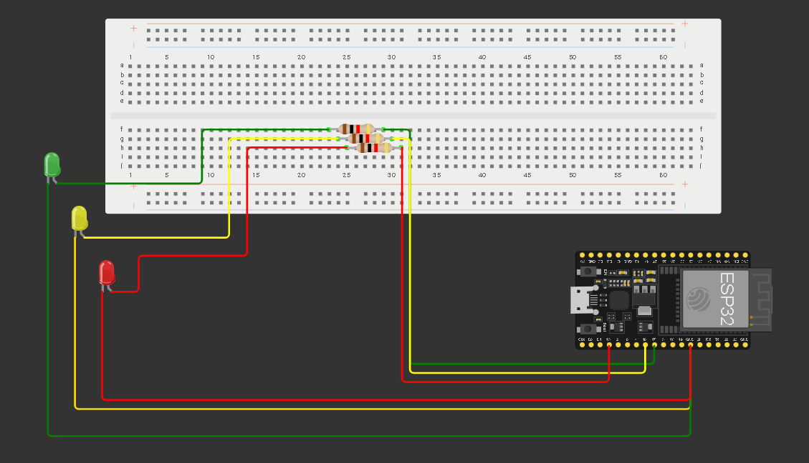
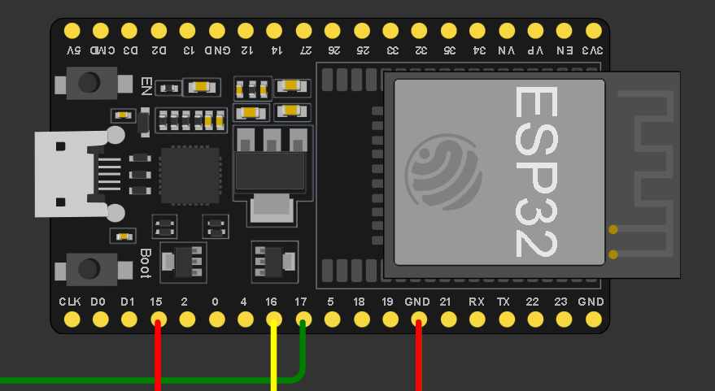

# 🚦 Projeto Semáforo com ESP32 (IoT)

## 📌 Descrição

Este projeto simula o funcionamento de um **semáforo** utilizando o microcontrolador **ESP32**, três LEDs (vermelho, amarelo e verde), resistores e uma protoboard. Toda a simulação foi realizada através da plataforma [Wokwi](https://wokwi.com/), utilizando **MicroPython** para controle dos pinos digitais do ESP32.

## 🧰 Tecnologias Utilizadas

- ESP32
- Protoboard
- Simulador Wokwi
- MicroPython

## 📷 Esquema de Montagem

### Montagem Geral:


### Conexão com o ESP32:


> As imagens acima representam a montagem simulada no Wokwi.

## 🔌 Conexões dos Componentes

| LED       | Pino no ESP32  |
|-----------|----------------|
| Verde     | GPIO 17        |
| Amarelo   | GPIO 16        |
| Vermelho  | GPIO 15        |

## 💻 Código Fonte (MicroPython)

```python
from machine import Pin
from utime import sleep

print("Hello world!")

vermelho = Pin(15, Pin.OUT)
amarelo = Pin(16, Pin.OUT)
verde = Pin(17, Pin.OUT)

while True:
    verde.on()
    print("LED VERDE LIGADO!")
    sleep(20)
    verde.off()
    print("LED VERDE DESLIGADO!")

    sleep(0.5)

    amarelo.on()
    print("LED AMARELO LIGADO!")
    sleep(10)
    amarelo.off()
    print("LED AMARELO DESLIGADO!")

    sleep(0.5)

    vermelho.on()
    print("LED VERMELHO LIGADO!")
    sleep(7)
    vermelho.off()
    print("LED VERMELHO DESLIGADO!")

    sleep(0.5)
```

## 📚 Informações Acadêmicas

- **Disciplina:** Internet das Coisas (IoT)
- **Professor(a):** Yuri
- **Instituição:** SENAI Jandira - Curso Técnico em Desenvolvimento de Sistemas
- **Ano/Semestre:** 2025 - 4º Semestre
